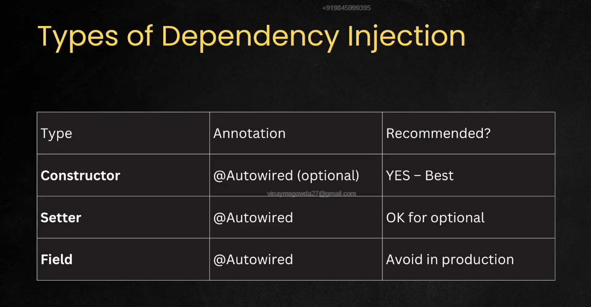

# Dependency Injection

This is a design pattern in Spring where an object gets another object as dependency/parameters without creating the object itself with new keyword.

## Types of Dependency Injection

